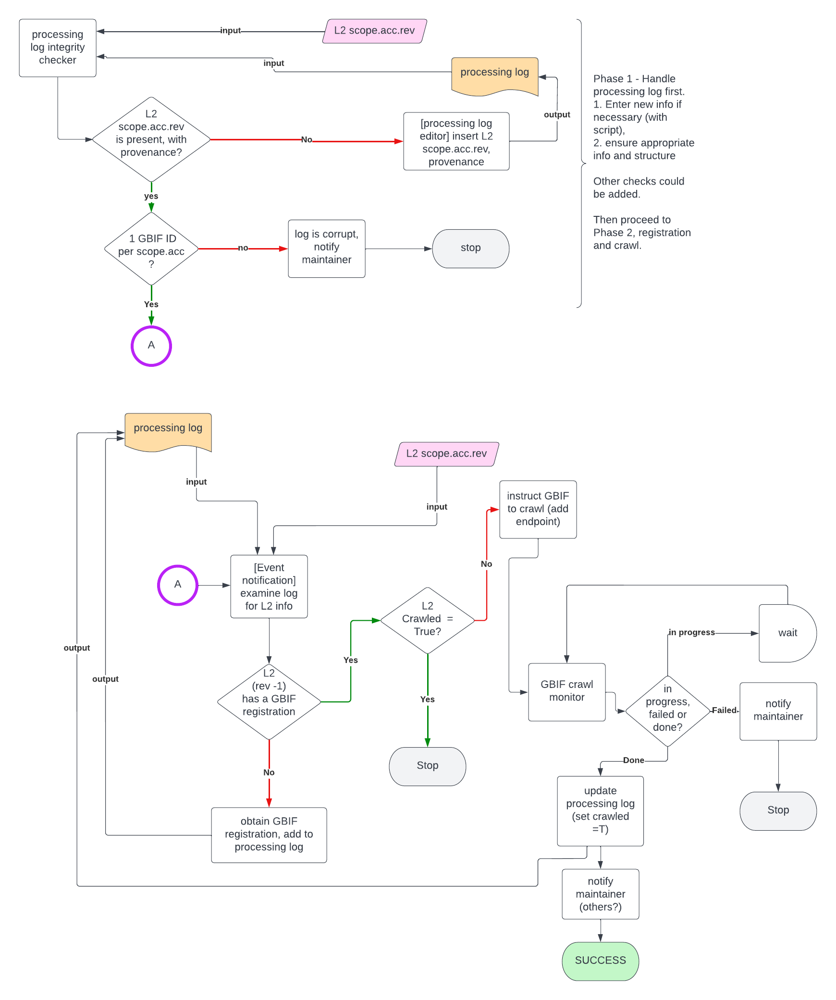

# GBIF

Materials for GBIF contributions

## scripts/

Scripts for registering a data package with GBIF and triggering a recrawl when that data package is updated in EDI. See the workflow schematic below for details.

## Requirements

## Recommendations

## Approach

## Workflow

